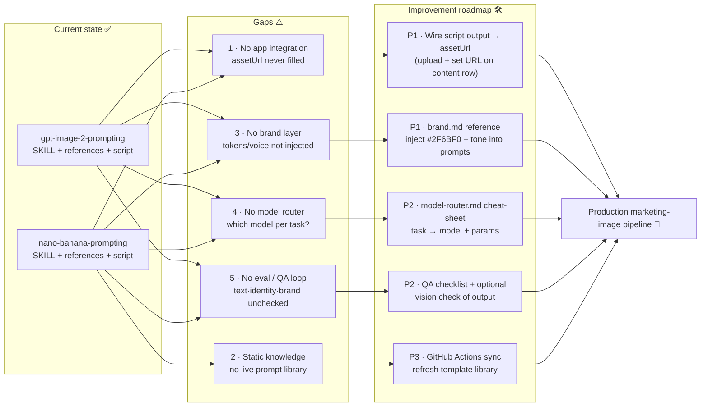

# Image-Prompting Skills — Gap Analysis & Improvement Roadmap

This document analyses the gap between the two prompt-writing skills shipped in
`.claude/skills/` and a **production marketing-image pipeline** for this repo,
and proposes a concrete, staged improvement path.

- **Skills delivered:** `gpt-image-2-prompting`, `nano-banana-prompting`
  (prompt-writing guidance + optional generation scripts).
- **Repo today:** the content schema exposes an `assetUrl` URL field
  (`js/views.js:176`, defaulted empty in `js/data.js`), but nothing populates it,
  and there is no brand layer feeding generation.

## What the skills already cover (current state)

| Capability | gpt-image-2 | nano-banana |
|------------|:-----------:|:-----------:|
| Prompt structure & techniques | ✅ | ✅ |
| Copy-paste marketing templates | ✅ | ✅ |
| Parameters / model selection | ✅ | ✅ |
| Identity-preserving edits | ✅ | ✅ |
| Multi-image blending | ✅ | ✅ |
| Optional API generation script | ✅ (OpenAI) | ✅ (Gemini) |

## Identified gaps

1. **No app integration.** The optional scripts write a local PNG; nothing wires
   the output URL back into the content `assetUrl` field, so generated assets
   never reach the dashboard.
2. **Static knowledge.** The references are a manual snapshot. There is no
   auto-synced, live prompt library (cf. YouMind's twice-daily GitHub Actions
   sync from a prompt CMS).
3. **No brand layer.** The skills don't inject the app's brand tokens (e.g.
   `--primary:#2F6BF0`) or tone-of-voice, so output isn't guaranteed on-brand.
4. **No model router.** There's no single decision aid for "use gpt-image-2 vs
   Nano Banana (vs their Pro/mini variants) for *this* marketing task".
5. **No eval / QA loop.** Nothing verifies that in-image text, identity, aspect
   ratio, and brand colors actually survived generation before an asset is used.

## Severity & effort

| Gap | Impact | Effort | Priority |
|-----|--------|--------|----------|
| 1. App integration (`assetUrl`) | High | M | P1 |
| 3. Brand layer | High | S | P1 |
| 4. Model router | Medium | S | P2 |
| 5. Eval / QA loop | Medium | M | P2 |
| 2. Live library sync | Low | M | P3 |

## Roadmap diagram

## Recommended next steps (in order)

1. **P1 — Brand layer:** add `reference/brand.md` to each skill listing the app's
   palette (`--primary:#2F6BF0`, dark-mode `#5B8DEF`), logo usage, and tone, and
   reference it from the prompt skeleton. Smallest change, biggest consistency win.
2. **P1 — App integration:** extend the generation scripts to upload the PNG
   (e.g. to Supabase storage, already used by `js/cloud.js`) and print a URL ready
   to paste into the content row's `assetUrl` field — or add a small helper in the
   app to call it.
3. **P2 — Model router:** add `docs/MODEL-ROUTER.md` mapping marketing task →
   recommended model + size/quality.
4. **P2 — QA loop:** add a post-generation checklist (text legible? identity kept?
   aspect correct? on-brand colors?), optionally automated with a vision check.
5. **P3 — Live library sync:** a scheduled GitHub Action to refresh template
   references from a curated source.

## Sources (GitHub)

- OpenAI Cookbook — image-gen models prompting guide.
- `JimmyLv/awesome-nano-banana` — Nano Banana technique & case collection.
- `gemini-cli-extensions/nanobanana` — official Nano Banana tooling.
- `YouMind-OpenLab/nano-banana-pro-prompts-recommend-skill` — Claude Code skill
  format + GitHub Actions library-sync pattern.
